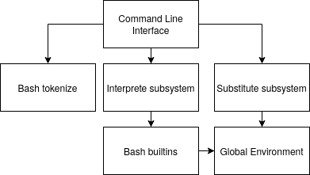
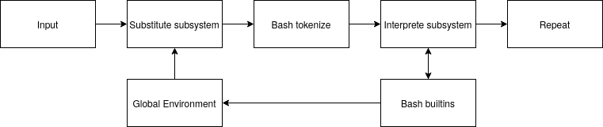

# Custom shell
### Dependencies graph:

### Data flow graph:

### Краткое описание деталей реализации:
cli.py содержит функцию run_cli(), которая получает 4 функции(выбирает реализации интерфейса):

read_command - Возвращает новую команду для исполнения () -> str

substitute - Производит замены $variable на значение variable в окружении. Сама анализирует кавычки. str -> str

tokenize - Разбивает строку на токены str -> List[str]

interpret - Запускает токенизированную команду(List[str]) и ждёт её завершения. List[str] -> Nothing

Алгоритм работы:
1. Считать команду с помощью read_command,
2. Сделать замены с помощью substitute,
3. Разбить команду на токены с помощью tokenize,
4. Запустить команду с помощью interpret

Реализация read_command сейчас считывает строку с консоли.

Реализация substitute сейчас производит замены всех $var вне строк в одинарных кавычках

Реализация tokenize сейчас использует shlex.split() для разбиения на токены

Реализация interpret:
1. Разбить входные токены на одиночные команды(без пайпов(|))
2. Запустить все одиночные команды, передав им в качестве stdin и stdout соответствующие анонимные пайпы.
3. Дождаться завершения каждой команды с помощью метода .wait() у объекта, возвращенного после запуска команды.
Закрыть все файловые дескрипторы, созданные для коммуникации.
4. Считать и вывести stdout последней команды.

Запуск одиночной команды производится таким алгоритмом:
1. Попытаться запустить команду как встроенную.
2. Если удалось, получить поток и обернуть его своим классом, добавив метод .wait(), который дожидается завершения.
3. Иначе запустить процесс и вернуть Popen объект, у которого есть .wait() для ожидания завершения.

По сути запуск одиночной команды возвращает какой-то объект с методом .wait() (такой интерфейс)